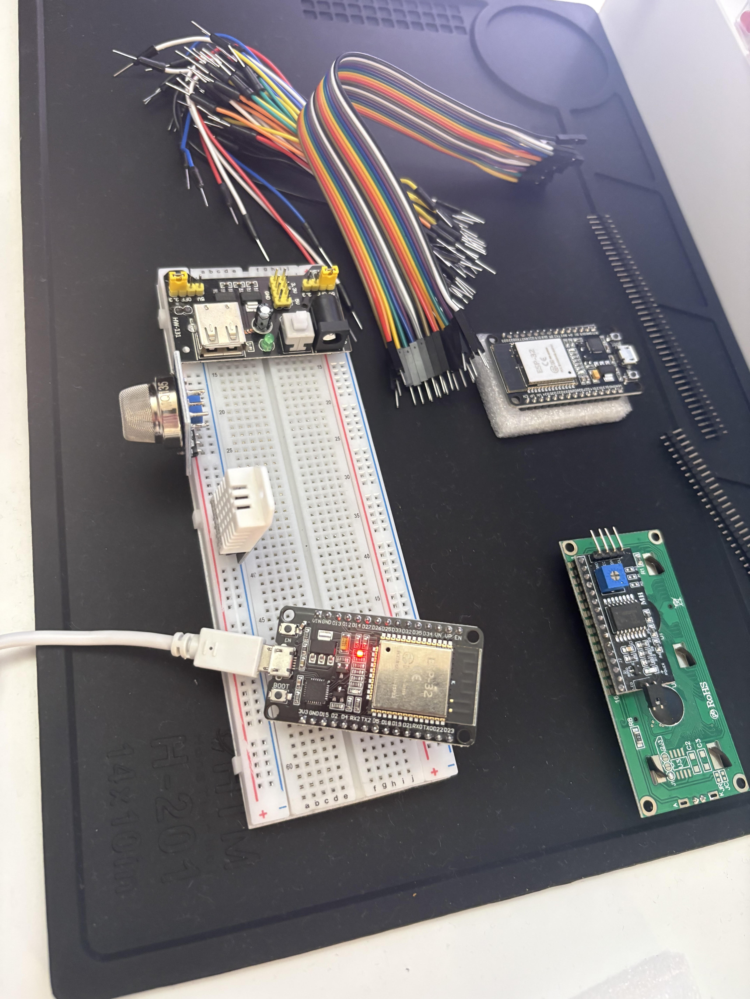

# Smart Environment Monitoring System

An IoT-based environmental monitoring system for intelligent window management

## Project Overview

A real-time environmental monitoring system built with ESP32 that provides intelligent recommendations for window management based on temperature, humidity, and air quality readings. This embedded systems project demonstrates sensor integration, real-time decision-making, IoT connectivity, and data visualization.

**Use Case:** Automatically alerts when environmental conditions indicate you should open or close your bedroom window to maintain optimal indoor air quality and comfort.

## Key Features

### Current Implementation (Phase 1)
- Multi-Sensor Integration: DHT22 temperature and humidity sensor, MQ-135 air quality sensor
- Real-Time Alert System: RGB LED visual indicators (green/yellow/red status), active buzzer for audio alerts, LCD display showing current readings
- Threshold Monitoring: Configurable temperature thresholds, humidity level monitoring, air quality assessment
- Decision Logic: Multi-factor analysis combining temperature, humidity, and air quality data

### Planned Features (Phase 2+)
- IoT Connectivity: WiFi communication via ESP32, MQTT protocol for real-time data transmission
- Data Logging: SD card storage for historical data, CSV export for trend analysis
- Web Dashboard: Real-time data visualization, historical graphs and trends, remote threshold configuration
- Mobile Integration: Push notifications, remote monitoring from anywhere

## Hardware Components

- Microcontroller: ESP32-WROOM-32 (WiFi/Bluetooth enabled)
- Temperature/Humidity Sensor: DHT22 (AM2302)
- Air Quality Sensor: MQ-135
- Display: I2C LCD 1602 (16x2 characters)
- Visual Alert: RGB LED (common cathode)
- Audio Alert: Active Buzzer (5V)
- Breadboard: 830 tie-points
- Jumper Wires and Resistors (220Ω, 10kΩ)

## System Architecture

### Hardware Layer
ESP32 microcontroller interfaces with multiple sensors (DHT22 for temperature/humidity, MQ-135 for air quality) and outputs (RGB LED, buzzer, LCD display). All components communicate via GPIO pins, with the LCD using I2C protocol for simplified wiring.

### Software Layer
Built on Arduino framework for ESP32, the system implements real-time sensor polling, threshold-based decision logic, and multi-modal alert generation. Future phases will add WiFi connectivity, MQTT messaging, and web dashboard integration.

## Software Stack

- Development Environment: PlatformIO (VS Code)
- Framework: Arduino for ESP32
- Programming Language: C/C++
- Key Libraries: DHT sensor library (Adafruit), LiquidCrystal I2C, PubSubClient (MQTT - future)

## Decision-Making Algorithm

The system continuously monitors environmental conditions and provides recommendations based on configurable thresholds:

- If temperature exceeds max or falls below min: Close window (RED alert)
- If humidity exceeds maximum threshold: Close window (YELLOW alert)
- If air quality drops below threshold: Close window (RED alert)
- If all conditions optimal: Window OK (GREEN status)

**Default Thresholds:**
- Temperature: 60°F - 78°F
- Humidity: < 70%
- Air Quality: TBD (requires calibration)

## Getting Started

### Prerequisites
- PlatformIO Core or PlatformIO IDE (VS Code extension)
- ESP32 USB drivers (CP210x or CH340)
- USB-C to USB-A adapter (for Mac users)

### Installation

1. Clone the repository
2. Install PlatformIO dependencies
3. Configure your settings in src/config.h (optional)
4. Build and upload to ESP32
5. Monitor serial output for debugging

### Wiring Guide
Detailed circuit diagrams and breadboard layouts available in /docs folder. Key connections: DHT22 DATA to GPIO4, LCD via I2C (SDA=GPIO21, SCL=GPIO22), RGB LED to GPIO25/26/27, Buzzer to GPIO13.

## Troubleshooting

**Sensor reads NaN or fails:** Check wiring connections (especially pull-up resistor for DHT22), verify correct GPIO pins in code, ensure adequate power supply, try different sensor if available

**Upload fails:** Hold BOOT button during upload, check USB cable supports data transfer, verify correct COM port selected, try direct connection avoiding USB hubs

**LCD not displaying:** Scan for I2C address (0x27 or 0x3F), check SDA/SCL connections (GPIO 21/22), adjust contrast potentiometer on LCD

## Technologies Used

ESP32, C/C++, Arduino Framework, PlatformIO, I2C Protocol, MQTT (planned), React.js (planned), Git/GitHub

## License

MIT License - feel free to use this project as inspiration for your own learning

## Pictures as I go clean up later

1 - ESP32 connected, upload test successful

2 - DHT22/AM2302 sensor connected, code uploaded, temperature and humidity read succesful
